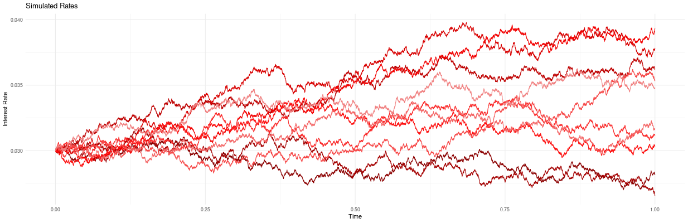

# Interest Rate Simulation

  

  <i>Cox-Ingersoll-Ross model</i>

This Shiny app simulates interest rate paths for one-factor equilibrium models using various stochastic differential equations (SDEs). Users can specify different types of equilibrium and volatility terms to observe how interest rates evolve over time under different scenarios.

### Constant Long-term Equilibrium and CEV Volatility

For a constant long-term equilibrium rate $\bar{r}$ and a constant elasticity of variance (CEV) model, the interest rate $r(t)$ follows the SDE:

$$
dr = -\alpha (r - \bar{r}) \, dt + \sigma r^{\gamma} \, dW(t)
$$

where:
- $\alpha$ is the speed of mean reversion.
- $\sigma$ is the volatility parameter.
- $\gamma$ is the elasticity of volatility.
- $dW(t)$ represents the increments of a Wiener process (Brownian motion).

### Constant Long-term Equilibrium and Dynamic Volatility

For a constant long-term equilibrium rate $\bar{r}$ and a dynamic volatility $\sigma(t)$, the interest rate $r(t)$ follows the SDE:

$$
dr = -\alpha (r - \bar{r}) \, dt + \sigma(t) \, dW(t)
$$

### Dynamic Long-term Equilibrium and CEV Volatility

For a dynamic long-term equilibrium rate $\theta(t)$ and a CEV volatility model, the interest rate $r(t)$ follows the SDE:

$$
dr = -\alpha (r - \theta(t)) \, dt + \sigma r^{\gamma} \, dW(t)
$$

### Dynamic Long-term Equilibrium and Dynamic Volatility

For a dynamic long-term equilibrium rate $\theta(t)$ and a dynamic volatility $\sigma(t)$, the interest rate $r(t)$ follows the SDE:

$$
dr = -\alpha (r - \theta(t)) \, dt + \sigma(t) \, dW(t)
$$

### Parameters and Inputs

- **Equilibrium Type**:
  - `Constant`: User specifies $\bar{r}$.
  - `Dynamic`: User specifies $\theta(t)$ as a function of time $t$.
  
- **Volatility Term**:
  - `CEV`: User specifies $\sigma$ and $\gamma$.
  - `Dynamic`: User specifies $\sigma(t)$ as a function of time $t$.

### Simulation Parameters

- **$\alpha$**: Speed of mean reversion.
- **$\sigma$**: Volatility parameter (used if `volatilityType` is CEV).
- **$\gamma$**: Elasticity of volatility (used if `volatilityType` is CEV).
- **$r_0$**: Initial interest rate.
- **$T$**: Time horizon for the simulation.
- **steps**: Number of discrete time steps.
- **nPaths**: Number of simulated paths.
- **confInterval**: Confidence interval for the summary statistics.

## Using the App

1. **Equilibrium Type**: Select either `Constant` or `Dynamic` equilibrium.
2. **Volatility Term**: Select either `CEV` or `Dynamic` volatility.
3. **Input Parameters**: Provide values for $\alpha$, $\sigma$, $\gamma$, $r_0$, $T$, `steps`, `nPaths`, and `confInterval`.
4. **Simulate**: Click the `Simulate` button to generate interest rate paths.
5. **Download**: Use the `Download Simulated Paths` button to download the simulated data.

## Outputs

- **Interest Rate Plot**: Displays the simulated interest rate paths.
- **Summary Plot**: Shows the median and confidence interval of the simulated paths.

## Feature Pipeline

I will add no-arbitrage and multi-factor models as I find more time.
